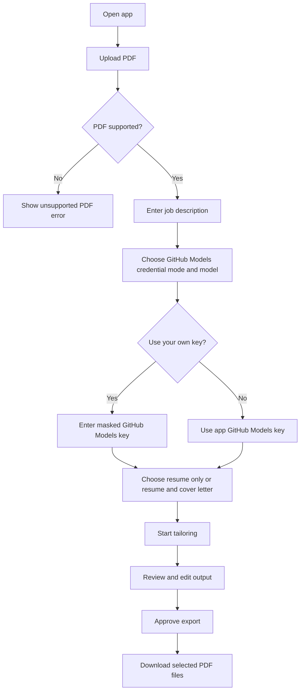

# UX Design: Resume Tailoring V1

**Feature**: #0001
**Epic**: #0001
**Status**: Approved (Planning Only)
**Designer**: GitHub Copilot
**Date**: 2026-04-01
**Related PRD**: [PRD-0001.md](../artifacts/prd/PRD-0001.md)

## 1. Overview

### Feature Summary
This UX design covers the single-user local-first resume tailoring workflow for PDF upload, GitHub Models credential selection, optional masked user key entry, optional cover letter generation, editable review, and export. The interface is designed to feel trustworthy, task-focused, and explicit about security boundaries.

When UI behavior, interaction order, or user-facing copy conflicts with other planning documents, this UX spec is the source of truth.

### Design Goals
1. Make the primary workflow understandable on first use.
2. Make sensitive key handling explicit and reassuring.
3. Keep editing and export review fast and low-friction.

### Success Criteria
- User can complete upload to editable draft in under 3 guided steps.
- Users understand that user-supplied GitHub Models keys are not saved.
- Error states for unsupported PDFs and invalid credential or model settings are recoverable.

## 2. Design Research & Posture

### Product Posture
- **Primary Posture**: Trust-led guided utility
- **Confidence Level Needed**: High-precision, explicit data-handling confidence

### Page Archetypes
- **Dominant Archetype**: Guided utility workspace
- **Rationale**: Users are completing a focused document task with sensitive inputs and want clarity, not exploration.

### Competitive Audit
| Product | Layout Strategy | Interaction Model | Takeaways (Use/Avoid) |
|---------|-----------------|-------------------|-----------------------|
| Resume.io | Guided form workflow | Step-based | Use clear task segmentation, avoid generic template-first bias |
| Jobscan | Analysis-first dashboard | Compare and optimize | Use side-by-side comparison cues |
| Canva resume tools | Creative workspace | Visual editing | Avoid over-emphasizing design controls in V1 |

### Anti-Patterns
- Hide security-sensitive behaviors in small helper text.
- Overload the first screen with too many credential and model decisions before upload context exists.

## 3. User Research

### User Personas
**Primary Persona: Individual job seeker**
- **Goals**: Tailor an existing PDF resume quickly
- **Pain Points**: Formatting breaks, resume edits are repetitive, sensitive content is involved
- **Technical Skill**: Intermediate
- **Device Preference**: Desktop

**Secondary Persona: Career coach**
- **Goals**: Produce reviewed drafts efficiently
- **Pain Points**: Repetitive editing and client-specific changes

### User Needs
1. Clear upload and validation flow for PDFs.
2. Clear explanation of GitHub Models credential handling.
3. An editable review surface for resume and optional cover letter content before export.

## 4. User Flows

### 4.1 Primary Flow: Tailor Resume
**Trigger**: User opens the app to tailor a resume.
**Goal**: Produce and export a reviewed tailored PDF.
**Preconditions**: User has a supported digital PDF and a job description.



### Error Scenarios
- Unsupported scanned PDF -> inline rejection with explanation.
- Invalid user key -> inline validation without saving the key.
- Timeout while using a user key -> tell the user to check their API key and retry.
- Overflow warning -> section flagged before export.

## 5. Wireframes

### Screen 1: Upload and Settings
```
+-------------------------------------------------------------+
| ResumeTailor                                                |
|-------------------------------------------------------------|
| Drop PDF here or click to upload                            |
| [ Select PDF ]                                              |
|                                                             |
| Job Description                                              |
| [ textarea .............................................. ] |
|                                                             |
| Credential Mode                                              |
| ( ) Use app GitHub Models key  ( ) Use my GitHub Models key |
|                                                             |
| Model                                                        |
| [ GPT-5.1 v ]                                               |
|                                                             |
| GitHub Models API Key                                        |
| [ *********************** ]                                 |
| Your key is used only for this request and is not saved.    |
|                                                             |
| Generate                                                     |
| ( ) Resume only  ( ) Resume and cover letter                |
|                                                             |
| [ Start Tailoring ]                                          |
+-------------------------------------------------------------+
```

### Screen 2: Review and Edit
```
+-------------------------------------------------------------+
| Original Section | Tailored Section                          |
|------------------|------------------------------------------|
| Summary text     | [ editable tailored text .............. ] |
| Experience item  | [ editable tailored text .............. ] |
| Cover letter     | [ editable cover letter text ......... ] |
| Warning: overflow risk in 1 section                         |
| [ Re-run ] [ Download resume PDF ] [ Download cover letter PDF ] |
+-------------------------------------------------------------+
```

## 6. Component Specifications

### Upload Zone
- Supports drag-and-drop and click-to-select.
- Shows hover, drag-active, invalid-file, and upload-ready states.

### Credential Panel
- Default selection: Use app GitHub Models key.
- User key field appears only for the user key mode.
- Security notice is always visible when user key mode is selected.
- The model list is limited to the curated top-5 GitHub Models shortlist.

### Review Editor
- Editable text areas by section, with the cover letter panel shown only when `Resume and cover letter` is selected.
- Warnings for overflow or unsupported rendering risk.

## 7. Design System

- 8px spacing rhythm
- High-contrast neutral palette with one confident accent color
- Desktop-first workspace, responsive down to tablet

## 8. Interactions & Animations

- Drag-active upload state uses a clear border and background shift.
- Start Tailoring button shows progress state during generation.
- Validation messages appear inline, not as blocking modals.

## 9. Accessibility (WCAG 2.1 AA)

- Upload zone must be keyboard accessible.
- Model and credential controls must be labeled semantically.
- Masked API key field must not rely on placeholder-only labeling.
- Error messages must be screen-reader readable.

## 10. Responsive Design

- Desktop: two-column review layout.
- Tablet: stacked sections with sticky action bar.
- Mobile: out of primary target for V1, but forms remain functional.

## 11. AI & Conversational UX

- Explain GitHub Models credential choices in plain language.
- Show when the app key is used versus a user key.
- Explicitly state that user keys are not saved.
- On user-key timeout, tell the user to check their API key and retry.

## 12. Interactive Prototypes

- Prototype file: [resume-tailor-v1.html](prototypes/resume-tailor-v1.html)

## 13. Implementation Notes

- Keep credential mode and model selector adjacent to reduce ambiguity.
- Treat security copy as primary guidance, not a footnote.
- Surface overflow warnings before export.
- Keep section layout stable while conditionally showing cover letter controls only for `Resume and cover letter` mode.

## 14. Open Questions

~~Should unsupported mobile screens be blocked or merely degraded gracefully in V1?~~
**Resolved**: Mobile screens degrade gracefully in V1. No hard block. The layout collapses to a single-column stacked view. All functionality remains accessible; only the two-column review layout collapses. A banner may inform mobile users that the desktop experience is recommended for the review step.

## 15. References

- PRD-0001
- SPEC-0001

## 16. Governance Gate

- This UX specification is approved for planning and design validation only.
- Implementation work remains blocked until explicit CEO approval is provided.